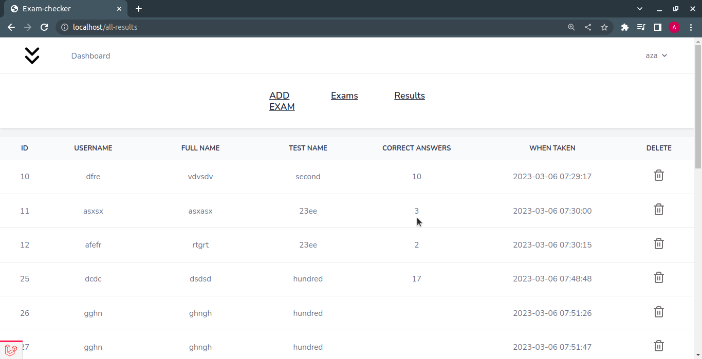

## Introduction

It's an app that provides answer sheets and enable students to self-assess their performance. The app allows admins or test authors to input answer keys, while students simply select the desired test and practice accordingly. The tools utilized for this project encompass Laravel, TailwindCSS, and Docker.

## Home page

## Choosing an exam

## Answer sheet

## Answering and submitting

## Results

## Admin login form

## Admin dashboard

## Updating answer keys

## Results

## Smartphone views

